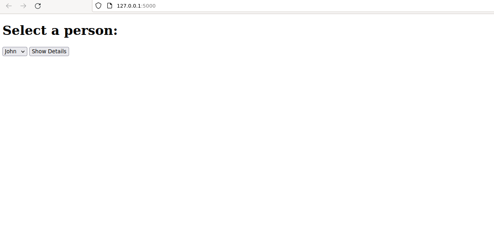
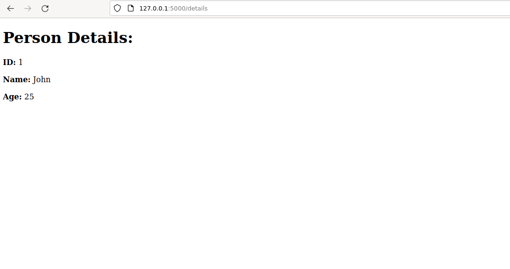

# Flask Data Pipeline Example

This code demonstrates a simple Flask application with 'Hello World' data pipeline.

# Running intructions

## Create a virtual environment

Create virtual environment in a console:

`python -m venv myenv`

or by adding Python interpreter in your editor's settings. 

## Activate the virtual environment

### On Windows

`myenv\Scripts\activate`

### On macOS/Linux

`source myenv/bin/activate`

## Install requirements

`pip install -r requirements.txt`

## Create a database file 

In order to create example.db run a file:

create_database.py:

`python create_database.py`

## Run the main file

`python app.py`

The development server should start, and you can access the application by visiting http://localhost:5000 or http://127.0.0.1:5000 in your web browser.

# Website views

